# Sign Language Interpreter (Photo Version)

For the real time detection version runned locally, please click this [link](https://github.com/rahimnasir/sign-language-interpreter-com-vis-llm) to go to the repository.

## Introduction

This innovative project is designed to bridge the communication gap between individuals using sign language and those who do not understand it. By leveraging cutting-edge computer vision technologies like YOLO (You Only Look Once), this system interprets sign language gestures in real-time, converting them into readable text or spoken language.

Key Features:
- Real-Time Interpretation: Translates sign language gestures instantly, ensuring seamless communication.
- Gesture Support: Recognizes 18 basic English word.
- Medium Accuracy: Powered by the YOLO model, known for its speed and precision in object detection. May misdetected certain gestures.
- Chatbot Integration: Provide feedback based on sequentially detected words to interpret the sign language. Give advice on how to approach the deaf person based on the gestures.
## Instruction
1. Clone the repository
```
git clone https://github.com/rahimnasir/sign-language-interpreter-photo.git
```
2. Open Anaconda Prompt and choose the environment with Langflow installed. If the environment has no Langflow installed, install Langflow into the environment.
3. Use the command to run Langflow
```
langflow run
```
4. After Langflow is opened, import the JSON which contain the Langflow chatbot for the application into Langflow. The imported bot doesn't have OpenAI API Key. Please insert the OpenAI API Key.
5. Open Ngrok terminal and run the command with authentication key to add authentication key. You only need to do this once.
```
ngrok config add-authtoken <YOUR_AUTH_TOKEN>
```
6. Run the command in the Ngrok terminal to set port 7860 to public.
```
ngrok http 7860
```
7. After running the command, copy and paste the forwarding https  to replace the localhost. Here's an example of copying and pasting the forwarding https:

8. Lastly, go to this link: 
5. Enjoy doing the gesture!

## Gesture List
- Apple 

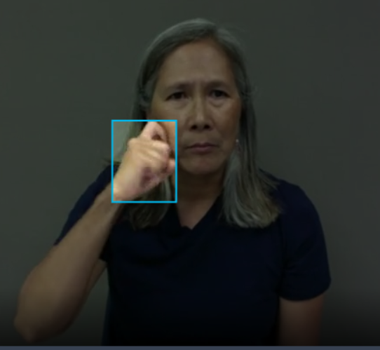

- Can

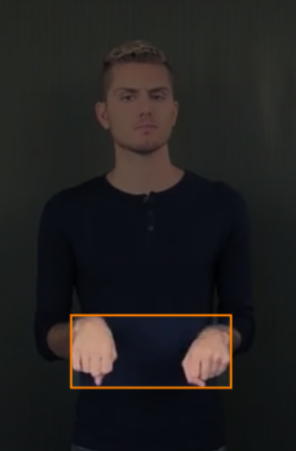

- Get

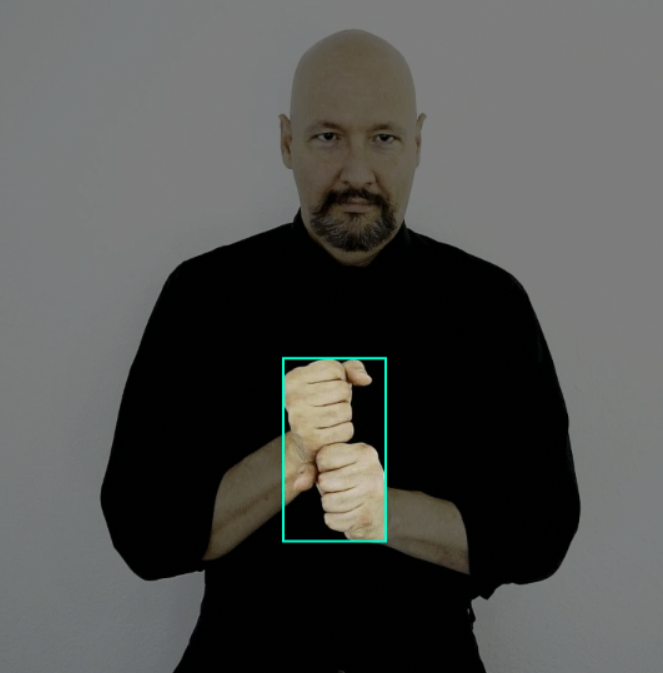

- Good

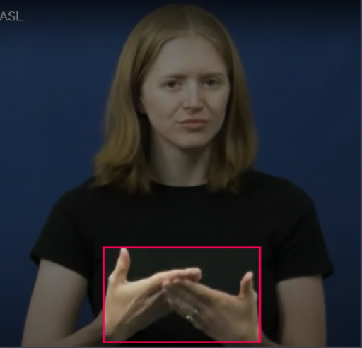

- Have

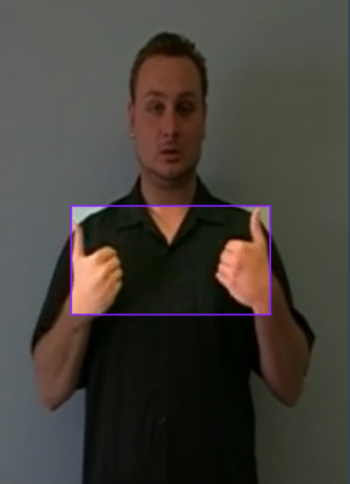

- Help

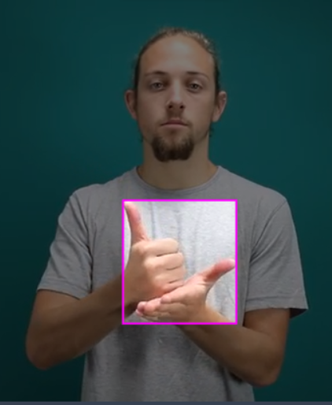

- How

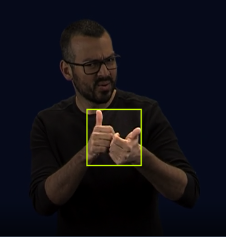

- I

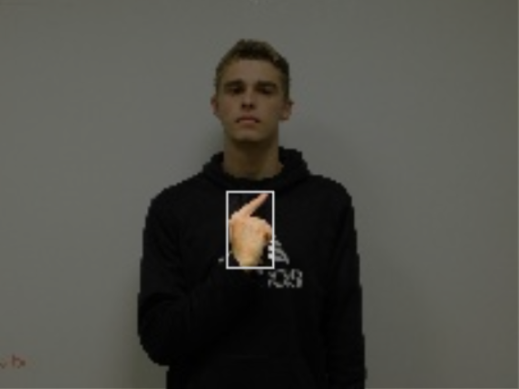

- Like


- Love


- My

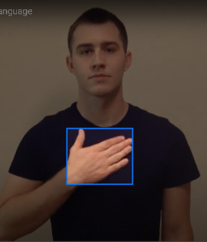

- No

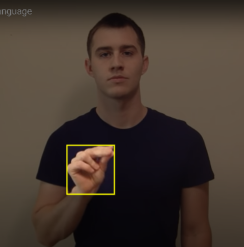

- Sorry

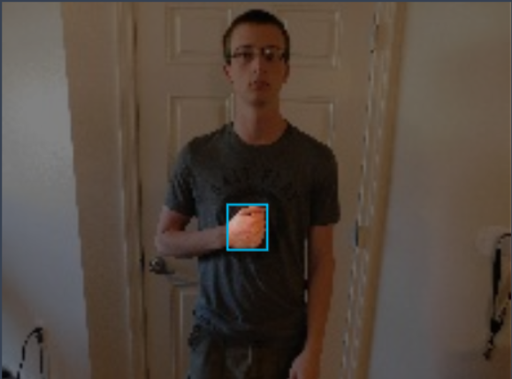

- Thank You

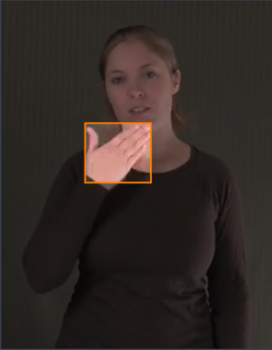

- Want

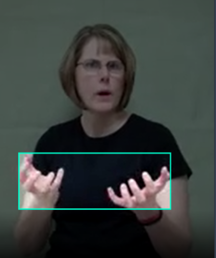

- Yes

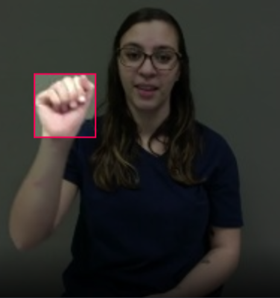

- You

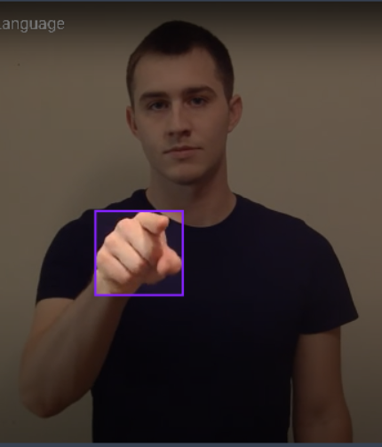

- Your

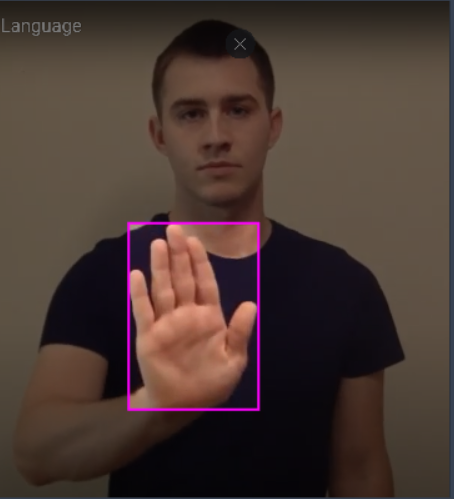


## Dataset
Roboflow Dataset: [ASL Dataset Computer Vision Project](https://universe.roboflow.com/asl-dataset/asl-dataset-p9yw8) by Cole Belfry.

ASL Website Dictionary: [SignASL.org](https://www.signasl.org)
